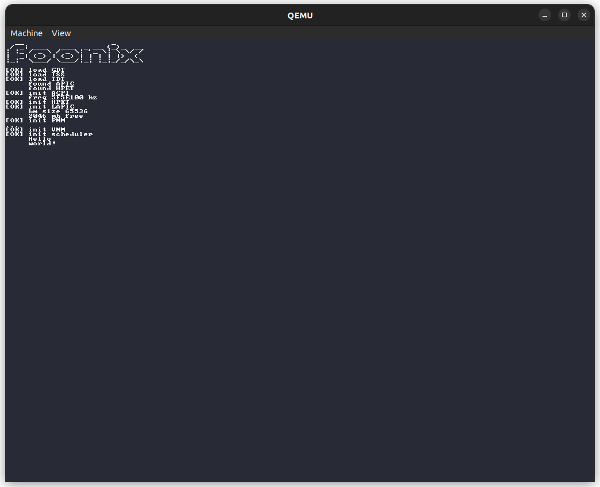

<p align="center"></p>
<p align="center"><i>a tiny kernel for the x86_64 architecture</i></p>
<p align="center"></p>

## Build

Some packages such as `gcc` (and `ld`, the GNU linker), `nasm` and `xorriso` are needed to build the kernel. Keeping that into account, simply do:

```sh
git clone https://github.com/dacousb/foonix-kernel
cd foonix-kernel
make
```

In case of a missing package error, install it.

## About the name

Have you ever heard of foo and bar? That's it.

## License

[MIT](license).